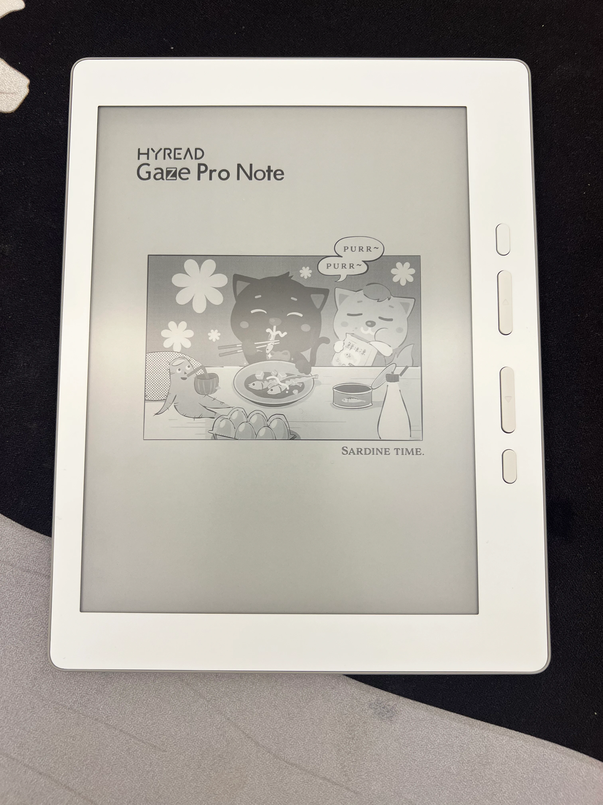

手上的 mookink 6 吋閱讀器已好多年，開書翻頁的延遲都有些長。加上最近忙得不可開交，就買了這台 Gaze Pro Note 給自己動力。

這台外觀如下

我只有舊的 mookink 6吋當作比較對象，以下主觀感受

優點:
1. 手感不錯，背面材質摸起來舒服
2. 翻頁速度快
3. 可翻很多頁後才閃黑刷新
4. 可以電子圖書館借閱

缺點:
1. 耗電較高
2. 左邊框較窄，左手手持容易誤觸畫面，我香腸手指(X
3. 介面較雜亂 (我不會用到筆記/手寫/字典等功能，純看書)

耗電部分等多使用再感受看看，平時關 wifi & 藍牙會更好些。
接下來還要試試 Readmoo app 情況，希望也很順能看以前買的書。
