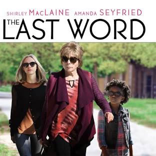

## 劇情

From wiki page:
哈莉葉是一位退休的女強人，身為控制狂的她嚴格控管生活裡所有瑣事，就連自己的訃聞都不放過親自監督的權力。年輕的訃聞小編安臨危受命接下這個艱難的任務，在調查哈莉葉招致非議的過去時，安漸漸發現這個表面上難搞討厭的老女人，其實有不為人知的一面，兩人逐漸建立起忘年友誼，並在彼此身上找到自己遺忘已久的熱情，也為哈莉葉人生最後的旅程寫下了全新的一頁。

## 心得

本片並沒有什麼瘋狂的衝突或非常狗血的畫面，平靜的陳述故事的發生。
演員將角色詮釋得非常好，表現出哈莉葉對自我的要求與堅持、有著自己的格調。這種人通常在現實中是難以相處的，但能說這樣的人是壞人嗎？

在我個人觀點，他只是選擇了一條覺得對自己負責的路，這條路是對是錯沒有人知道，也沒有一條路會是完美的，如同哈莉葉與家人的關係，或許並不是他想要的。

對哈莉葉而言廣告公司已經是他的舒適圈，當知道自己可能時日無多，就放手去嘗試自己曾想做的事當 DJ，畢竟如果生命已快結束，還要擔心失去什麼呢。

另一方面安的家庭也很有趣，她的母親並沒有出現在電影畫面中，是個想要冒險不安於平凡生活的人因此在安還小的時候就離開了家。而安的父親則相反的留在家照顧安長大，他認真生活也很快樂。或許這不是選擇冒險與不冒險，而是每個人都有自己合適的生活方式，衡量風險、勇於嘗試，如同電影所說: `當你失敗了你就會學懂，當你失敗了你才算活著。`或許就能找到自己。不管是選擇冒險或是追求快樂的生活，認真過活。即使是靜靜的聽一首歌、看一部電影，都是好好的活著。

最後，附上電影中很喜歡的一句話：
>請不要只過安逸的日子
而要努力充實每一天
真實的一天、直率的一天、誠摯的一天
安逸的一天…你會很悲慘

>做好你的家事、家庭作業
專心開車、專心玩、專心工作
每一天都要過得有意義

