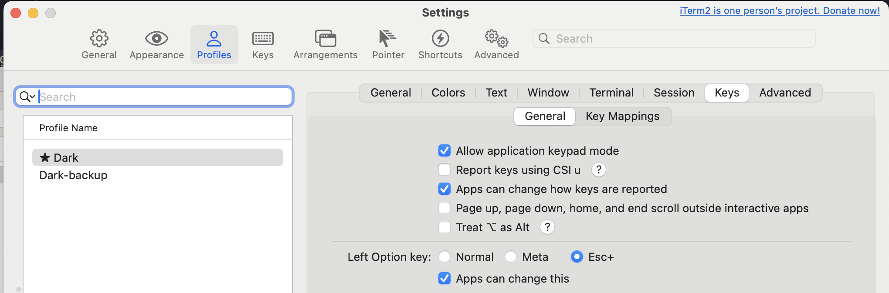

### fisher

```shell
curl -sL https://raw.githubusercontent.com/jorgebucaran/fisher/main/functions/fisher.fish | source && fisher install jorgebucaran/fisher
```

### tide

```shell
fisher install IlanCosman/tide@v6
```

### sponge

```shell
fisher install meaningful-ooo/sponge
```

### autopair

```shell
fisher install jorgebucaran/autopair.fish
```

### fzf

```shell
fisher install PatrickF1/fzf.fish
```

In iterm2, we need to change`Left Option key` setting to let `ctrl + alt + F` work.


