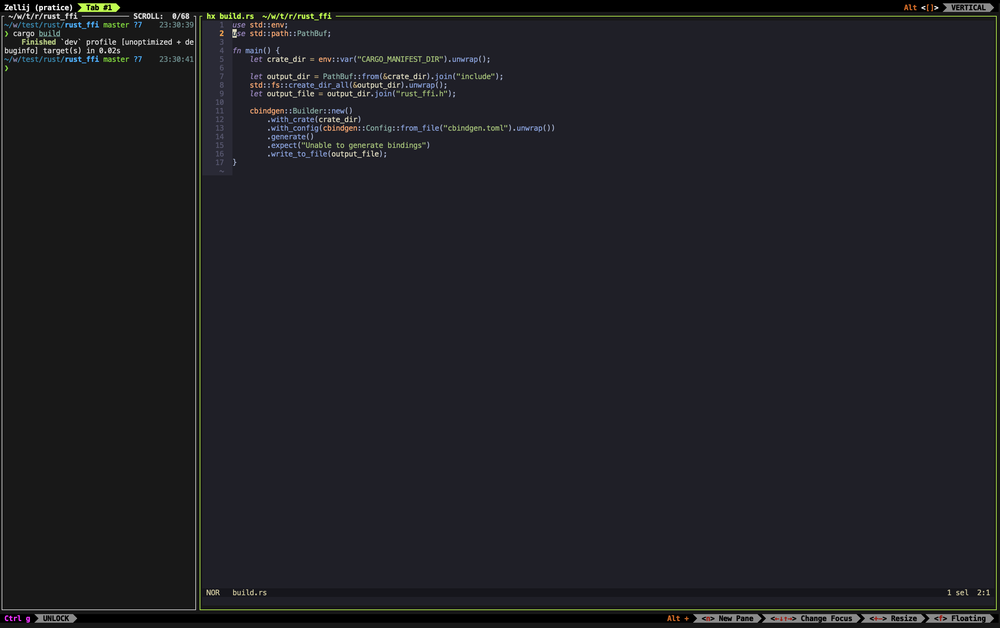

Zellij 是一個 Terminal Multiplexers，如同 tmux 一樣。
那為什麼會想要介紹 zellij 呢？

1. tmux plugin 較多設定較麻煩
2. 可取代 iterm2 的 tab
3. zellij 安裝方便
4. 快捷鍵直接顯示在 UI 不用記
5. 想換個東西試試 (X

有什麼缺點呢？
1. 多了個邊框，畫面更擁擠
2. 功能較多要重新熟悉操作
3. 尚未進入 V1.0 版本

在目前的環境他可以簡單做出如下的 layout，左方可用來 build 或操作，右邊則是編輯程式。

將 zellij 設定為 unlock-first mode 後可以透過 `C-g`  解鎖 keybinding。例如使用  `C-g t n`  是建立新 tab，又參考右下角的提示，可以用 `Alt n`  建立新的 pane 並且使用 `Alt + arrow` 直接切換到下一個 pane/tab。如此簡單的功能就非常實用了。

當想要用不同 session 時可以用 `C-g o w`  進入 session manager，這樣就可以建立/刪除/切換多個 session。可以取代掉 Iterm2 本身 tab 的功能。

目前使用這些最基礎功能，後續再嘗試與 yazi / helix 等工具的整合。
